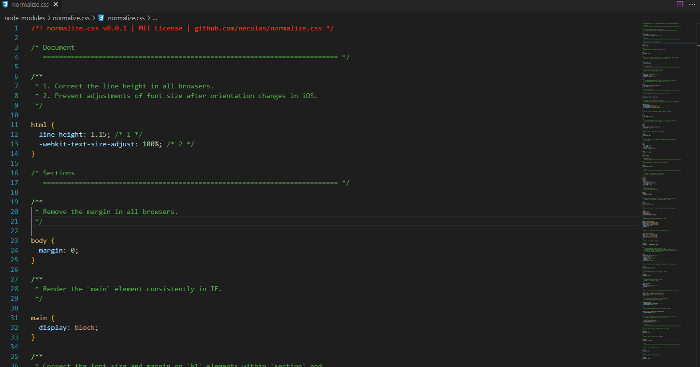

# CSS解决方案

CSS解决方案是之针对不同浏览器自带得默认样式进行一个统一表现。

比如：body 默认有 margin 即使内部元素全部填充上 也没有铺满整体
是不是熟悉以下样式定义, 这是我们所常见得用来确定统一body，还有个浏览器默认得 h1 大小等等。
```css
body {
    margin: 0;
    padding: 0;
}
h1 {
  font-size: 2em;
  margin: 0.67em 0;
}
```

 这就需要一个能为大部分元素提供一般化的表现;最好还能让他们载各个浏览器表现一致;


以更为推荐的 `Normalize.css 为例`，它的核心思想是：

> Normalize.css 使浏览器更一致地呈现所有元素并符合现代标准。它精确地只针对需要规范化的样式。

## 下载
官网：https://necolas.github.io/normalize.css/
```js
pnpm run normalize.css
```

## 源码



源码算上大量注释一共就300多行，每一个样式都有详细得作用说明。

## 使用
::: tip
尽可能最优先加载。
:::
### 以vue中为例
我是将Normalize.css 放在项目执行之前加载。

按照样式都放到 `assets/css/base.scss` 中统一引用，减少主文件代码量
:::: code-group
::: code-group-item main.ts
```ts{4}
import { createApp } from 'vue'
import App from './App.vue'
...
import '@/assets/css/base.scss'
...
const app = createApp(App).mount('#app')
```
:::
::: code-group-item base.scss
```ts{1}
@import '/node_modules/normalize.css/normalize.css';
...
html, body, #app{
  width: 100%;
  height: 100%;
}
...
```
:::
::::

# 其他
`sanitize.css、Modern-CSS-Reset`。感兴趣得自行了解。

# 扩展
## CSS规范化
见下章
## CSS 预处理语言
见下章